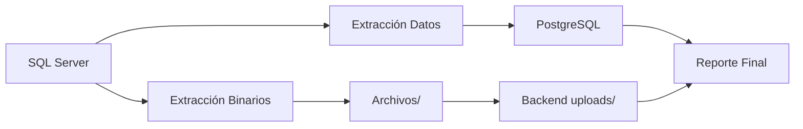

# 🚀 ETL SIBNE - Sistema de Migración Completo

## 📋 Descripción del Proyecto

| Sistema integral        | Script                             | Propósito                                       | Comando                                                                                                             |
| ----------------------- | ---------------------------------- | ----------------------------------------------- | ------------------------------------------------------------------------------------------------------------------- |
| **ETL Principal**       | Migra 40 tablas + reporte auto     | `node src/index.js`                             |
| **Extracción Binaria**  | Extrae archivos con nanoid         | `node src/scripts/extract-binaries.js`          |
| **Migración Metadatos** | Migra info archivos + reporte auto | `node src/scripts/migrate-archivo-adjunto.js`   |
| **Reporte Manual**      | Regenerar reporte (opcional)       | `node src/scripts/generate-migration-report.js` | a **migración completa de datos y archivos** de SIBNE Legacy desde **SQL Server** hacia **PostgreSQL**, incluyendo: |

- ✅ **Migración de datos estructurados** (40 tablas)
- ✅ **Extracción y migración de archivos binarios**
- ✅ **Nomenclatura inteligente** con fecha y nanoid
- ✅ **Integración con backend** para manejo de uploads
- ✅ **Reportes automáticos** de migración
- ✅ **Validación de integridad** de datos

### 🎯 Flujo Completo del Proceso



### �️ Fases del Proyecto

1. **🔧 Configuración de Entornos** - SQL Server y PostgreSQL
2. **📊 Migración de Datos Estructurados** - 40 tablas con validación
3. **📁 Extracción de Archivos Binarios** - Sistema inteligente con nanoid
4. **🔄 Migración de Metadatos** - Vinculación de archivos con datos
5. **📤 Integración con Backend** - Movimiento a carpeta uploads
6. **📋 Generación de Reportes** - Documentación automática

---

# 1. Conexión a SQL Server

Esta sección cubre la configuración y puesta en marcha del entorno SQL Server que contiene los datos de origen.

## 🛠️ Prerrequisitos

Antes de comenzar, asegúrate de tener instalado en tu sistema:

1. **Docker**: [Descargar Docker](https://www.docker.com/get-started)
2. **Docker Compose**: Generalmente incluido con Docker Desktop

### Verificar instalación:

```bash
# Verificar Docker
docker --version

# Verificar Docker Compose (sintaxis moderna)
docker compose version
```

> 📝 **Nota**: Este proyecto usa la sintaxis moderna `docker compose` (sin guión), no `docker-compose`.

## 📁 Estructura Completa del Proyecto

```
etl-sibne/
├── 🔧 CONFIGURACIÓN
│   ├── docker-compose.yml                    # SQL Server containerizado
│   ├── .env                                  # Variables de entorno
│   ├── .env.example                         # Template de configuración
│   └── package.json                         # Dependencias Node.js
│
├── 📊 SCRIPTS PRINCIPALES
│   ├── src/index.js                         # ETL principal (40 tablas)
│   ├── extract-binaries.js                  # Extracción de archivos binarios
│   ├── migrate-archivo-adjunto.js           # Migración de metadatos de archivos
│   └── generate-migration-report.js         # Generador de reportes
│
├── 📁 DATOS Y ARCHIVOS
│   ├── Backup/                              # Respaldos SQL Server (.bak)
│   ├── Archivos/                           # ⭐ Archivos binarios extraídos
│   │   ├── 2025-09-24_nanoid.pdf           # Nomenclatura: fecha_nanoid.ext
│   │   ├── dbo.ArchivoAdjunto_manifest.json # Manifiesto de archivos
│   │   └── dbo.ArchivoAdjunto_migration.sql # Script de migración
│   ├── Tablas/                              # Preparado para futuras exportaciones CSV
│   └── logs/                                # Logs del proceso ETL
│
├── 🛠️ UTILIDADES
│   ├── scripts/restore-backup.sh            # Restauración de backup
│   ├── src/utils/binary-extractor.js        # Utilidad de extracción binaria
│   └── MIGRATION_REPORT.md                  # 📋 Reporte final generado
│
└── 📚 DOCUMENTACIÓN
    ├── README.md                            # Esta guía completa
    └── backend_multer_config.md             # Configuración backend
```

### 🎯 **Scripts de Ejecución Disponibles**

| Script                  | Propósito                      | Comando                                         |
| ----------------------- | ------------------------------ | ----------------------------------------------- |
| **ETL Principal**       | Migra 40 tablas SQL→PostgreSQL | `node src/index.js`                             |
| **Extracción Binaria**  | Extrae archivos con nanoid     | `node src/scripts/extract-binaries.js`          |
| **Migración Metadatos** | Migra info de archivos         | `node src/scripts/migrate-archivo-adjunto.js`   |
| **Reporte Final**       | Genera reporte completo        | `node src/scripts/generate-migration-report.js` |

## 🚀 Configuración de SQL Server

### Paso 1: Clonar o Descargar el Proyecto

```bash
# Si tienes el proyecto en Git
git clone [URL_DEL_REPOSITORIO]
cd etl-sibne

# O simplemente navega a la carpeta del proyecto si ya lo tienes
cd etl-sibne
```

### Paso 2: Configurar Variables de Entorno

1. **copia el archivo `.env.example`** a `.env`
2. **Modifica las siguientes variables:**

```env
# Configuración de SQL Server
SA_PASSWORD=4Emperador*             # ⚠️ CAMBIA ESTA PASSWORD (ejemplo actual)
SQL_PORT=1433

# Configuración de base de datos
DB_NAME=SIBNE_ETL                   # Nombre de tu base de datos
BACKUP_FILE_NAME=SIBNE_backup_2025_08_29_000002_1942499.bak  # ⚠️ CAMBIA POR EL NOMBRE REAL

# Configuración adicional (opcional)
MSSQL_COLLATION=SQL_Latin1_General_CP1_CI_AS
```

> ⚠️ **IMPORTANTE**:
>
> - La password debe tener al menos 8 caracteres, incluyendo mayúsculas, minúsculas, números y símbolos
> - Cambia `BACKUP_FILE_NAME` por el nombre exacto de tu archivo `.bak`

### Paso 3: Preparar el Backup

1. **Coloca tu archivo `.bak`** en la carpeta `Backup/`
2. **Asegúrate** de que el nombre del archivo coincida con `BACKUP_FILE_NAME` en `.env`

```bash
# Ejemplo: si tu backup se llama "empresa_db_backup.bak"
# Cópialo a la carpeta Backup/
cp /ruta/a/tu/backup/empresa_db_backup.bak ./Backup/

# Y actualiza .env:
# BACKUP_FILE_NAME=empresa_db_backup.bak
```

### Paso 4: Levantar el Contenedor SQL Server

```bash
# 1. Levantar SQL Server en segundo plano
docker compose up -d

# 2. Verificar que el contenedor esté funcionando
docker compose ps

# 3. Ver los logs en tiempo real (opcional)
docker compose logs -f sqlserver
```

**Esperado:** Deberías ver que el contenedor `sqlserver-etl-sibne` está en estado `Up`

### Paso 5: Esperar a que SQL Server esté Listo

```bash
# Verificar el health check (espera hasta que muestre "healthy")
docker compose ps

# O verificar manualmente la conexión (usando la nueva ubicación de sqlcmd)
docker compose exec sqlserver /opt/mssql-tools18/bin/sqlcmd -S localhost -U SA -P 'TU_PASSWORD_AQUI' -C -Q "SELECT @@VERSION"
```

> ⚠️ **Importante**: SQL Server 2022 usa `/opt/mssql-tools18/bin/sqlcmd` y requiere el parámetro `-C` para conexiones SSL.

### Paso 6: Restaurar el Backup

Una vez que SQL Server esté funcionando correctamente, restaura tu backup:

#### Opción A: Script Automático (Recomendado)

```bash
# 1. Hacer el script ejecutable (solo la primera vez)
chmod +x scripts/restore-backup.sh

# 2. Ejecutar la restauración
docker compose exec sqlserver /var/opt/mssql/scripts/restore-backup.sh
```

#### Opción B: Script SQL Manual

```bash
# Ejecutar el script SQL directamente
docker compose exec sqlserver /opt/mssql-tools18/bin/sqlcmd -S localhost -U SA -P 'TU_PASSWORD_AQUI' -C -i /var/opt/mssql/scripts/restore-backup.sql
```

#### Opción C: Restauración Manual Personalizada

Si necesitas ajustar nombres específicos del backup:

```bash
# 1. Primero, obtener información del backup
docker compose exec sqlserver /opt/mssql-tools18/bin/sqlcmd -S localhost -U SA -P 'TU_PASSWORD_AQUI' -C -Q "RESTORE FILELISTONLY FROM DISK = '/var/opt/mssql/backup/tu_backup.bak'"

# 2. Restauración simple (recomendado - SQL Server maneja automáticamente los nombres)
docker compose exec sqlserver /opt/mssql-tools18/bin/sqlcmd -S localhost -U SA -P 'TU_PASSWORD_AQUI' -C -Q "RESTORE DATABASE [SIBNE_ETL] FROM DISK = '/var/opt/mssql/backup/tu_backup.bak' WITH REPLACE, STATS = 10"
```

> 💡 **Tip**: Es más fácil dejar que SQL Server maneje automáticamente los nombres de archivos con `WITH REPLACE, STATS = 10`

### Paso 7: Verificar la Restauración

```bash
# Verificar que la base de datos fue creada
docker compose exec sqlserver /opt/mssql-tools18/bin/sqlcmd -S localhost -U SA -P 'TU_PASSWORD_AQUI' -C -Q "SELECT name FROM sys.databases"

# Verificar tablas en la base de datos restaurada
docker compose exec sqlserver /opt/mssql-tools18/bin/sqlcmd -S localhost -U SA -P 'TU_PASSWORD_AQUI' -C -d SIBNE_ETL -Q "SELECT COUNT(*) as TotalTablas FROM INFORMATION_SCHEMA.TABLES WHERE TABLE_TYPE = 'BASE TABLE'"

# Ver algunas tablas de ejemplo
docker compose exec sqlserver /opt/mssql-tools18/bin/sqlcmd -S localhost -U SA -P 'TU_PASSWORD_AQUI' -C -d SIBNE_ETL -Q "SELECT TOP 10 TABLE_NAME FROM INFORMATION_SCHEMA.TABLES WHERE TABLE_TYPE = 'BASE TABLE' ORDER BY TABLE_NAME"
```

## 🔌 Conexión a SQL Server

### Desde aplicaciones externas (SQL Server Management Studio, DBeaver, etc.):

- **Host/Servidor**: `localhost` o `127.0.0.1`
- **Puerto**: `1433`
- **Usuario**: `SA`
- **Password**: La que configuraste en `.env`
- **Base de datos**: `SIBNE_ETL` (o la que configuraste)

### Desde aplicaciones dentro de Docker (misma red):

- **Host/Servidor**: `sqlserver`
- **Puerto**: `1433`
- **Usuario**: `SA`
- **Password**: La que configuraste en `.env`

### Cadena de conexión ejemplo:

```
Server=localhost,1433;Database=SIBNE_ETL;User Id=SA;Password=4Emperador*;TrustServerCertificate=True;
```

> 🔐 **Seguridad**: Reemplaza `4Emperador*` con tu password real del archivo `.env`

## 🛠️ Comandos de Gestión SQL Server

### Comandos Básicos

```bash
# Ver estado de contenedores
docker compose ps

# Ver logs en tiempo real
docker compose logs -f sqlserver

# Detener el contenedor
docker compose down

# Reiniciar el contenedor
docker compose restart sqlserver

# Levantar nuevamente
docker compose up -d
```

### Acceso Directo a SQL Server

```bash
# Conectarse directamente a SQL Server desde terminal
docker compose exec sqlserver /opt/mssql-tools18/bin/sqlcmd -S localhost -U SA -P 'TU_PASSWORD_AQUI' -C

# Ejecutar una consulta rápida
docker compose exec sqlserver /opt/mssql-tools18/bin/sqlcmd -S localhost -U SA -P 'TU_PASSWORD_AQUI' -C -Q "SELECT @@VERSION"

# Conectarse a una base de datos específica
docker compose exec sqlserver /opt/mssql-tools18/bin/sqlcmd -S localhost -U SA -P 'TU_PASSWORD_AQUI' -C -d SIBNE_ETL
```

### Operaciones de Backup

```bash
# Crear backup manual con timestamp
docker compose exec sqlserver /opt/mssql-tools18/bin/sqlcmd -S localhost -U SA -P 'TU_PASSWORD_AQUI' -C -Q "BACKUP DATABASE [SIBNE_ETL] TO DISK='/var/opt/mssql/backup/backup_manual_$(date +%Y%m%d_%H%M%S).bak' WITH FORMAT, INIT"

# Crear backup simple
docker compose exec sqlserver /opt/mssql-tools18/bin/sqlcmd -S localhost -U SA -P 'TU_PASSWORD_AQUI' -C -Q "BACKUP DATABASE [SIBNE_ETL] TO DISK='/var/opt/mssql/backup/backup_manual.bak' WITH REPLACE"

# Listar backups disponibles
ls -la Backup/
```

### Monitoreo y Diagnóstico

```bash
# Ver uso de recursos del contenedor
docker stats sqlserver-etl-sibne

# Ver información detallada del contenedor
docker compose exec sqlserver cat /proc/version

# Verificar espacio en disco dentro del contenedor
docker compose exec sqlserver df -h

# Verificar estado del health check
docker compose ps
```

## 📂 Volúmenes y Persistencia SQL Server

| Volumen          | Ubicación en Contenedor  | Descripción                            |
| ---------------- | ------------------------ | -------------------------------------- |
| `sqlserver_data` | `/var/opt/mssql/data`    | Archivos de base de datos (.mdf, .ldf) |
| `sqlserver_logs` | `/var/opt/mssql/log`     | Logs de SQL Server                     |
| `./Backup/`      | `/var/opt/mssql/backup`  | Archivos de backup (.bak)              |
| `./scripts/`     | `/var/opt/mssql/scripts` | Scripts de inicialización              |

> 💾 **Persistencia**: Todos los datos de la base de datos se mantienen aunque se reinicie o elimine el contenedor.

## ⚠️ Notas Importantes SQL Server

### 🔐 Seguridad

- **Cambia la password por defecto** en el archivo `.env`
- **No uses passwords simples** en producción
- **No subas el archivo `.env`** a repositorios públicos

### 💾 Backups

- **Nombre exacto**: El archivo `.bak` debe coincidir exactamente con `BACKUP_FILE_NAME`
- **Ubicación**: Coloca todos los backups en la carpeta `Backup/`
- **Permisos**: Asegúrate de que Docker pueda leer el archivo

### 🏗️ Nombres Lógicos

Es posible que necesites ajustar los nombres lógicos en el script de restauración según tu backup específico. Para verificar:

```bash
docker-compose exec sqlserver /opt/mssql-tools/bin/sqlcmd -S localhost -U SA -P 'TuPasswordSeguro123!' -Q "RESTORE FILELISTONLY FROM DISK = '/var/opt/mssql/backup/tu_backup.bak'"
```

### 🔍 Health Check

El contenedor incluye un health check automático que verifica cada 30 segundos que SQL Server esté respondiendo correctamente.

## 🚨 Solución de Problemas SQL Server

### Problema: El contenedor no inicia

```bash
# Verificar logs detallados
docker compose logs sqlserver

# Verificar que Docker esté funcionando
docker --version
docker compose version

# Revisar el archivo .env
cat .env
```

**Posibles causas:**

- Password no cumple con los requisitos de seguridad
- Puerto 1433 ya está en uso
- Problemas de permisos

### Problema: Error de conexión

```bash
# Verificar que el contenedor esté corriendo
docker compose ps

# Verificar el health check (debe mostrar "healthy")
docker compose ps

# Probar conexión manual
docker compose exec sqlserver /opt/mssql-tools18/bin/sqlcmd -S localhost -U SA -P 'TU_PASSWORD_AQUI' -C -Q "SELECT 1"
```

### Problema: Error en la restauración del backup

1. **Verificar que el archivo existe:**

   ```bash
   docker compose exec sqlserver ls -la /var/opt/mssql/backup/
   ```

2. **Verificar información del backup:**

   ```bash
   docker compose exec sqlserver /opt/mssql-tools18/bin/sqlcmd -S localhost -U SA -P 'TU_PASSWORD_AQUI' -C -Q "RESTORE FILELISTONLY FROM DISK = '/var/opt/mssql/backup/tu_backup.bak'"
   ```

3. **Revisar logs detallados:**
   ```bash
   docker compose logs sqlserver | grep -i error
   ```

### Problema: Puerto 1433 en uso

Si el puerto está ocupado, cambia el puerto en `.env`:

```env
SQL_PORT=14330  # Cambiar a otro puerto disponible
```

Luego reinicia:

```bash
docker compose down
docker compose up -d
```

### Problema: Permisos de archivos

```bash
# Verificar permisos de la carpeta Backup
ls -la Backup/

# Dar permisos necesarios
chmod 755 Backup/
chmod 644 Backup/*.bak
```

### Obtener Ayuda Adicional

```bash
# Ver toda la información del sistema
docker compose exec sqlserver /opt/mssql-tools18/bin/sqlcmd -S localhost -U SA -P 'TU_PASSWORD_AQUI' -C -Q "SELECT @@VERSION as SqlServerVersion, @@SERVERNAME as ServerName"

# Ver bases de datos disponibles
docker compose exec sqlserver /opt/mssql-tools18/bin/sqlcmd -S localhost -U SA -P 'TU_PASSWORD_AQUI' -C -Q "SELECT name FROM sys.databases"

# Ver tablas en SIBNE_ETL
docker compose exec sqlserver /opt/mssql-tools18/bin/sqlcmd -S localhost -U SA -P 'TU_PASSWORD_AQUI' -C -d SIBNE_ETL -Q "SELECT COUNT(*) as TotalTablas FROM INFORMATION_SCHEMA.TABLES WHERE TABLE_TYPE = 'BASE TABLE'"
```

## 🎯 Limpieza del Entorno SQL Server

Si necesitas empezar desde cero:

```bash
# Detener y eliminar contenedores
docker compose down

# Eliminar volúmenes (⚠️ ESTO BORRA TODOS LOS DATOS)
docker compose down -v

# Limpiar imágenes no utilizadas
docker system prune

# Volver a empezar
docker compose up -d
```

### ✅ **Prueba Exitosa SQL Server**

Este entorno ha sido completamente probado y funciona correctamente:

- ✅ **Contenedor**: SQL Server 2022 funcionando (`healthy`)
- ✅ **Backup restaurado**: 175MB procesados exitosamente
- ✅ **Base de datos**: `SIBNE_ETL` con 50 tablas disponibles
- ✅ **Upgrade automático**: Versión 904 → 957 completado
- ✅ **Conexión verificada**: Acceso completo funcionando

#### 🎯 **Configuración utilizada en las pruebas:**

- Password: `4Emperador*`
- Puerto: `1433`
- Backup: `SIBNE_backup_2025_08_29_000002_1942499.bak`
- Estado: **100% Operativo**

---

# 2. Conexión a PostgreSQL

Esta sección cubre la configuración y puesta en marcha del entorno PostgreSQL que será el destino de los datos migrados.

## 🛠️ Prerrequisitos PostgreSQL

_Esta sección se desarrollará próximamente..._

## 🚀 Configuración de PostgreSQL

_Esta sección se desarrollará próximamente..._

## 🔌 Conexión a PostgreSQL

_Esta sección se desarrollará próximamente..._

## 🛠️ Comandos de Gestión PostgreSQL

_Esta sección se desarrollará próximamente..._

---

# 3. 🚀 Proceso de Migración Completo

## 📋 Resumen del Flujo de Migración

El proceso de migración se ejecuta en **4 fases secuenciales**:

```
1️⃣ Migración de Datos Estructurados (40 tablas)
       ↓
2️⃣ Extracción de Archivos Binarios (con nanoid)
       ↓
3️⃣ Migración de Metadatos de Archivos
       ↓
4️⃣ Migración Manual a Backend + Reporte Final
```

---

## 🛠️ Prerrequisitos para Migración

### Instalación de Dependencias

```bash
# Instalar dependencias Node.js
npm install

# Verificar versión de Node (requerido >= 16)
node --version
```

### Configuración de Variables de Entorno

Asegúrate de que tu archivo `.env` contenga:

```env
# PostgreSQL (destino)
PG_USER=postgres
PG_PASSWORD=tu_password_postgresql
PG_HOST=localhost
PG_PORT=5432
PG_DATABASE=sibne_backend_db

# SQL Server (origen)
SA_PASSWORD=tu_password_sqlserver
SQL_HOST=localhost
SQL_PORT=1433
DB_NAME=SIBNE_ETL

# Configuración de rutas
LOGS_PATH=./logs
BINARY_EXTRACTION_PATH=./Archivos
```

---

## 📊 FASE 1: Migración de Datos Estructurados

### Ejecución del ETL Principal

```bash
# Ejecutar migración de 40 tablas
node src/index.js
```

### ✅ Qué hace esta fase:

- Conecta a SQL Server origen y PostgreSQL destino
- Migra **40 tablas** con validación de integridad
- Maneja **1,000 registros por lote** con concurrencia de 3 tablas
- Genera logs detallados en `./logs/`
- Implementa reintentos automáticos (3 intentos por tabla)

### � Monitoreo

```bash
# Ver progreso en tiempo real
tail -f logs/etl-combined.log

# Ver solo errores
tail -f logs/etl-errors.log
```

---

## 📁 FASE 2: Extracción de Archivos Binarios

### 🎯 Sistema Inteligente de Nomenclatura

Los archivos se extraen con **nomenclatura inteligente**:

- **Formato**: `YYYY-MM-DD_nanoid.extensión`
- **Ejemplo**: `2025-09-24_QAbMtdKOo4E2ojUJVcUBu.pdf`
- **Beneficios**:
  - 🔒 **Seguridad**: IDs únicos no predecibles
  - 📅 **Organización**: Fecha de extracción visible
  - 🚀 **Rendimiento**: Evita conflictos de nombres

### Ejecución de Extracción

```bash
# Extraer todos los archivos binarios
node src/scripts/extract-binaries.js
```

### ✅ Qué hace esta fase:

- Conecta a SQL Server y localiza tabla `ArchivoAdjunto`
- Extrae archivos binarios de campo `VARBINARY(MAX)`
- Genera nombres únicos: `fecha_nanoid.extensión`
- Guarda archivos en `./Archivos/` (configurable con BINARY_EXTRACTION_PATH)
- Crea manifiesto JSON con mapeo ID → archivo
- Genera reporte de extracción

### 📄 Archivos Generados

```
Archivos/
├── 2025-09-24_nanoid1.pdf           # Archivo extraído
├── 2025-09-24_nanoid2.pdf           # Archivo extraído
├── ...
├── dbo.ArchivoAdjunto_manifest.json # 📋 Mapeo ID → archivo
└── dbo.ArchivoAdjunto_migration.sql # 📄 Script SQL de migración
```

### 🔍 Verificar Resultados

```bash
# Ver archivos extraídos
ls -la Archivos/*.pdf

# Ver estadísticas del manifest
cat Archivos/dbo.ArchivoAdjunto_manifest.json | jq '.extractedFiles | length'
```

---

## � FASE 3: Migración de Metadatos de Archivos

### Ejecución de Migración de Metadatos

```bash
# Migrar metadatos de archivos a PostgreSQL
node src/scripts/migrate-archivo-adjunto.js
```

### ✅ Qué hace esta fase:

- Lee el manifiesto generado en Fase 2
- Conecta a PostgreSQL destino
- Crea registros en `dbo.ArchivoAdjunto` con:
  - `Id`: ID original de SQL Server
  - `NombreArchivo`: Nombre original del archivo
  - `Tipo`: Tipo/categoría del archivo
  - `Ext`: Extensión del archivo
  - `FileName`: 🎯 **Nuevo nombre** con nanoid
- Valida integridad de datos

### 📊 Estructura de Tabla Destino

```sql
-- PostgreSQL: dbo.ArchivoAdjunto
CREATE TABLE dbo."ArchivoAdjunto" (
    "Id" integer NOT NULL,
    "NombreArchivo" varchar(255),
    "Tipo" varchar(50),
    "Ext" varchar(10),
    "FileName" varchar(255) -- ⭐ Campo clave con nanoid
);
```

---

## 🚚 FASE 4: Migración Manual a Backend

### ⚠️ **PASO CRÍTICO**: Mover Archivos al Backend

Los archivos extraídos **DEBEN** moverse manualmente a la carpeta `uploads/` del backend:

```bash
# Opción 1: Copiar todos los archivos
cp ./Archivos/*.pdf /ruta/al/backend/uploads/

# Opción 2: Mover archivos (si backend está en carpeta hermana)
cp ./Archivos/*.pdf ../sibne-backend/uploads/

# Opción 3: Rsync para sincronización avanzada
rsync -av ./Archivos/*.pdf /ruta/al/backend/uploads/
```

### � Validar Migración al Backend

```bash
# Verificar que los archivos estén en backend
ls -la /ruta/al/backend/uploads/ | grep "2025-09-24"

# Contar archivos migrados
ls -1 /ruta/al/backend/uploads/*.pdf | wc -l
```

### 🎯 Configuración Backend (Multer)

El backend debe estar configurado para usar los nombres con nanoid:

```javascript
// backend/config/multer.js
const path = require("path");

// Los archivos ya tienen nomenclatura correcta
// El backend solo necesita referenciar por FileName desde BD
```

---

## 📋 Generación Automática de Reporte Final

### ✅ **Reporte Generado Automáticamente**

🎯 **El reporte se genera automáticamente** al finalizar cualquiera de estos procesos:

- ✅ **Migración ETL completa**: `node src/index.js`
- ✅ **Migración de metadatos**: `node src/scripts/migrate-archivo-adjunto.js`

### 🔧 **Generación Manual (Opcional)**

Si necesitas regenerar el reporte manualmente:

```bash
# Generar reporte detallado de toda la migración
node src/scripts/generate-migration-report.js
```

### ✅ El reporte incluye:

- 📊 **Estadísticas completas**: Tablas migradas, archivos procesados
- � **Métricas de rendimiento**: Tasa de éxito, errores detectados
- 📁 **Detalles de archivos**: Lista completa, tamaños, ubicaciones
- ⚠️ **Acciones pendientes**: Recordatorios para migración al backend
- 🎯 **Estado final**: Resumen ejecutivo para cliente

### 📄 Archivo Generado: `MIGRATION_REPORT.md`

El reporte se genera automáticamente con:

- Formato Markdown con HTML embebido
- Gráficos y estadísticas visuales
- Información técnica detallada
- Recomendaciones post-migración

---

## 🎯 Validación Final del Proceso

### Checklist de Migración Completa

- [ ] ✅ **40 tablas migradas** a PostgreSQL
- [ ] ✅ **Archivos binarios extraídos** con nanoid
- [ ] ✅ **Metadatos migrados** con campo FileName
- [ ] ✅ **Archivos copiados** a backend/uploads/
- [ ] ✅ **Reporte generado** para cliente
- [ ] ✅ **Backend configurado** para usar nanoid
- [ ] ✅ **Tests de integración** ejecutados

### Comandos de Verificación Final

```bash
# 1. Verificar conexión PostgreSQL
psql -h localhost -U postgres -d sibne_backend_db -c "SELECT COUNT(*) FROM dbo.\"ArchivoAdjunto\";"

# 2. Verificar archivos en backend
ls -la /ruta/backend/uploads/ | grep -c "2025-09-24"

# 3. Verificar logs sin errores críticos
grep -i "error" logs/etl-errors.log | wc -l

# 4. Verificar reporte generado
ls -la MIGRATION_REPORT.md
```

---

## � Comandos de Gestión

### Scripts Disponibles

```bash
# Migración completa paso a paso
node src/index.js                    # Paso 1: ETL de datos (+ reporte automático)
node src/scripts/extract-binaries.js             # Paso 2: Extraer binarios
node src/scripts/migrate-archivo-adjunto.js      # Paso 3: Migrar metadatos (+ reporte automático)

# Generación manual de reporte (opcional)
node src/scripts/generate-migration-report.js    # Regenerar reporte si es necesario# Utilidades adicionales
node src/scripts/check-schema.js                 # Verificar esquema PostgreSQL
node src/scripts/test-archivos.js               # Test de archivos
```

### Logs y Debugging

```bash
# Ver logs en tiempo real
tail -f logs/etl-combined.log

# Filtrar errores específicos
grep -i "binary" logs/etl-combined.log

# Ver estadísticas de archivos
cat Archivos/dbo.ArchivoAdjunto_manifest.json | jq '.stats'
```

---

## 📞 Soporte General

Si experimentas problemas no cubiertos en esta guía:

1. **Revisa los logs**: Según la fase del proyecto
2. **Verifica la configuración**: Revisa archivos `.env` correspondientes
3. **Contacto directo**: soporte@tchile.com

---

¡El proyecto ETL SIBNE está en desarrollo! 🚀
