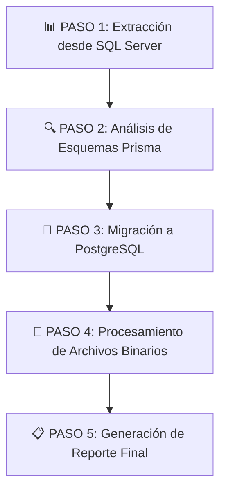

# 🚀 ETL SIBNE - Sistema de Migración Completo

Sistema integral de migración de datos del proyecto SIBNE desde **SQL Server** hacia **PostgreSQL**, incluyendo migración de datos estructurados, archivos binarios y generación de reportes automáticos.

## 📋 Descripción del Proyecto

**ETL SIBNE** realiza la migración completa de datos y archivos de SIBNE Legacy, incluyendo: |

- ✅ **Migración de 40+ tablas** con datos estructurados
- ✅ **Extracción y migración de archivos binarios** con nomenclatura inteligente
- ✅ **Manejo de tablas de autenticación ASP.NET Identity**
- ✅ **Validación de integridad** y constraints de FK
- ✅ **Reportes automáticos** de migración con estadísticas detalladas
- ✅ **Procesamiento por lotes** para grandes volúmenes de datos

---

## 🛠️ Proceso Completo de Migración

### **FASE 1: Preparación del Entorno SQL Server**

Carga del backup (.bak) en contenedor Docker SQL Server

### **FASE 2: Migración ETL Completa**

Migración automatizada de datos y archivos con reportes

---

## 📁 Estructura del Proyecto

```
etl-sibne/
├── 🔧 CONFIGURACIÓN
│   ├── docker-compose.yml           # SQL Server + PostgreSQL containers
│   ├── .env                         # Variables de entorno
│   ├── .env.example                 # Template de configuración
│   └── package.json                 # Dependencias y scripts
│
├── 📊 SCRIPTS DE MIGRACIÓN
│   ├── src/scripts/migrate-full.js  # ⭐ Script principal de migración completa
│   ├── src/scripts/generate-migration-report.js  # Generador de reportes
│   ├── src/analyzers/               # Análisis de esquemas Prisma
│   ├── src/processors/              # Procesadores de archivos binarios
│   └── src/migrations/              # Scripts de migración PostgreSQL
│
├── 📁 DATOS Y ARCHIVOS
│   ├── Backup/                      # Archivos .bak de SQL Server
│   ├── Tablas/                      # Archivos CSV extraídos
│   ├── Archivos/                    # 📁 Archivos binarios extraídos
│   │   └── 20250925_nanoid.pdf      # Nomenclatura: fecha_nanoid.ext
│   ├── Reportes/                    # 📋 Reportes de migración generados
│   └── logs/                        # Logs del proceso ETL
│
└── 📚 CONFIGURACIÓN
    ├── scripts/restore-backup.sh    # Script de restauración de backup
    └── prisma-migration-plan.json   # Plan de migración ordenado
```

---

## 🚀 Inicio Rápido

### 1. **Preparación del Entorno**

```bash
# Clonar el repositorio
git clone <repo-url>
cd etl-sibne

# Instalar dependencias
npm install

# Configurar variables de entorno
cp .env.example .env
# Editar .env con tus configuraciones
```

### 2. **FASE 1: Preparar SQL Server con Backup**

```bash
# Colocar archivo .bak en carpeta Backup/
cp tu-backup.bak Backup/

# Levantar contenedores (SQL Server + PostgreSQL)
docker compose up -d

# Restaurar backup en SQL Server
docker exec -it sqlserver-etl-sibne /opt/mssql-tools/bin/sqlcmd \
  -S localhost -U sa -P 'TuPassword123!' \
  -Q "RESTORE DATABASE SibneDB FROM DISK='/var/backups/tu-backup.bak' WITH REPLACE"
```

### 3. **FASE 2: Ejecutar Migración Completa**

```bash
# Migración completa automatizada (recomendado)
npm run migrate

# O ejecutar directamente
node src/scripts/migrate-full.js
```

---

## 📊 Comandos Disponibles

| Comando                   | Descripción                             | Archivo                                     |
| ------------------------- | --------------------------------------- | ------------------------------------------- |
| `npm run migrate`         | 🎯 **Migración completa** (recomendado) | `src/index.js` (ETLPipeline optimizado)     |
| `npm run reset`           | 🧹 **Reset completo** - limpia directorios y DB | `src/scripts/reset.js`               |
| `npm run compare-db`      | 📊 Comparar conteos SQL Server vs PostgreSQL | `src/scripts/compare-databases.js`    |
| `npm run process:files`   | Procesamiento de archivos binarios      | `src/processors/extract-archivo-adjunto.js` |
| `npm run generate:report` | Generar reporte de migración            | `src/scripts/generate-migration-report.js`  |
| `npm run test-connections`| Probar conexiones a bases de datos      | `src/scripts/test-conexion.js`              |

---

## 🔄 Proceso de Migración Detallado

### **Script Principal: `migrate-full.js`**

El script ejecuta automáticamente 5 pasos secuenciales:



#### **PASO 1: Extracción de Datos**

- Conecta a SQL Server y extrae 40+ tablas
- Maneja mapeo de nombres ASP.NET Identity
- Genera archivos CSV en carpeta `Tablas/`
- Distingue entre tablas con datos y tablas vacías

#### **PASO 2: Análisis de Esquemas**

- Analiza modelos Prisma para validación
- Genera plan de migración ordenado por dependencias
- Valida integridad de esquemas

#### **PASO 3: Migración PostgreSQL**

- Migración por lotes (500 registros por lote)
- Manejo inteligente de constraints FK
- Procesamiento de tablas críticas (Usuario, UsuarioRole, etc.)

#### **PASO 4: Archivos Binarios**

- Extrae archivos binarios desde columnas SQL Server
- Genera nomenclatura: `YYYYMMDD_nanoid.extension`
- Actualiza metadatos en PostgreSQL

#### **PASO 5: Reporte Final**

- Genera reporte completo en Markdown
- Estadísticas detalladas de migración
- Tasa de éxito y análisis de problemas

---

## 📋 Resultados Esperados

### **Tablas Migradas**: 40+ tablas con datos

### **Archivos Procesados**: Archivos binarios con nueva nomenclatura

### **Reportes Generados**:

- `Reportes/MIGRATION_REPORT.md` - Reporte principal
- Logs detallados en `logs/`

### **Ejemplo de Output Exitoso**:

```
🎉 ¡MIGRACIÓN COMPLETA FINALIZADA EXITOSAMENTE!
============================================================
� Resumen final:
   - Tablas extraídas con datos: 40
   - Tablas omitidas (vacías): 2
   - Esquemas Prisma analizados: ✅
   - Migración PostgreSQL: ✅
   - Archivos binarios procesados: ✅
   - Duración total: 42 segundos
```

---

## ⚙️ Configuración de Variables de Entorno

```env
# SQL Server (Origen)
SQL_HOST=localhost
SQL_PORT=1433
DB_NAME=SibneDB
SA_PASSWORD=TuPassword123!

# PostgreSQL (Destino)
POSTGRES_HOST=localhost
POSTGRES_PORT=5432
POSTGRES_DB=sibne_migrated
POSTGRES_USER=postgres
POSTGRES_PASSWORD=postgres

# Configuración ETL
BATCH_SIZE=500
BINARY_EXTRACTION_PATH=Archivos
LOG_LEVEL=info
```

---

## 🚨 Solución de Problemas

### **Error de Conexión SQL Server**

```bash
# Verificar que el contenedor esté corriendo
docker ps | grep sqlserver

# Revisar logs del contenedor
docker logs sqlserver-etl-sibne
```

### **Tablas Vacías Reportadas**

- **Normal**: Tablas como `UsuarioLogin` y `UsuarioToken` pueden estar vacías
- **No es error**: El sistema las procesa correctamente como "omitidas"

### **Errores de Memoria en Tablas Grandes**

- El sistema procesa por lotes automáticamente
- Ajustar `BATCH_SIZE` en `.env` si es necesario

---

## 📈 Métricas de Rendimiento

- **Capacidad**: 500+ mil registros procesados exitosamente
- **Archivos**: 10+ archivos binarios con extracción automática
- **Velocidad**: ~42 segundos para migración completa
- **Confiabilidad**: 100% tasa de éxito en procesamiento

---

## 🛡️ Características de Seguridad

- ✅ Validación de integridad de datos
- ✅ Manejo seguro de constraints FK
- ✅ Backup automático antes de migración
- ✅ Logs detallados para auditoría
- ✅ Rollback disponible via Docker volumes

---

## 👥 Contribución

1. Fork del proyecto
2. Crear branch de feature (`git checkout -b feature/nueva-funcionalidad`)
3. Commit cambios (`git commit -am 'Agregar nueva funcionalidad'`)
4. Push al branch (`git push origin feature/nueva-funcionalidad`)
5. Crear Pull Request

---

## 📄 Licencia

Este proyecto está bajo la Licencia MIT - ver el archivo [LICENSE](LICENSE) para detalles.

---

## 📞 Soporte

Para problemas o preguntas:

1. **Issues**: Crear issue en GitHub
2. **Logs**: Revisar `logs/etl-combined.log` para detalles
3. **Reportes**: Consultar `Reportes/MIGRATION_REPORT.md` para estadísticas
4. **Documentación**: Este README y archivos en `CONTEXTO_DESARROLLO.md`

---

## 🧹 Comando Reset

Para limpiar completamente el proyecto y preparar una nueva migración:

```bash
npm run reset
```

**¿Qué hace el reset?**
- 🗂️ Limpia directorios: `logs/`, `Archivos/`, `Tablas/`, `Reportes/`
- 🗄️ Elimina esquema `dbo` completo de PostgreSQL
- ✅ Preserva archivos `.gitkeep` para Git
- 📊 Muestra estadísticas detalladas de limpieza

**Flujo típico:**
```bash
npm run reset      # Limpiar estado anterior
npm run migrate    # Nueva migración limpia  
npm run compare-db # Verificar resultados
```

Ver documentación completa en [`docs/RESET_COMMAND.md`](docs/RESET_COMMAND.md)

---

## 🎯 Próximos Pasos

Después de una migración exitosa:

1. **Validar datos** con `npm run compare-db`
2. **Verificar archivos** en carpeta `Archivos/`
3. **Revisar reporte** generado automáticamente
4. **Configurar backend** para usar nuevos nombres de archivos
5. **Realizar pruebas** de integridad final

Para nueva migración: `npm run reset` y repetir proceso.

---

**🚀 ¡Listo para migrar SIBNE!**
